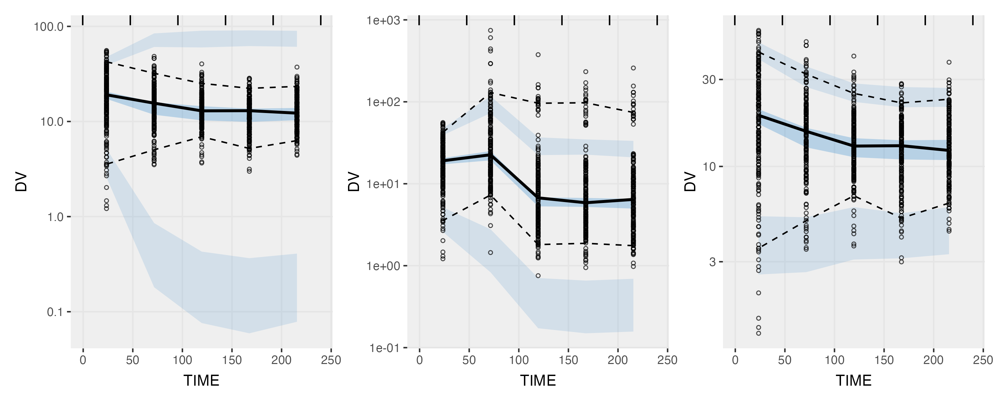

# The VPC and Real World Data

The visual predictive check (VPC) is a standard tool for assessing
pharmacometric model suitability, producing visualizations that compare
observed data with simulated data such that both model structure and
model variability terms can be assessed. However, real-world data
commonly reflect clinical decision-making that adapts therapy in
response to patient data. As a result, VPCs constructed from such data
may display apparent model misspecification, even when models are
well-specified. 

A [Short Report in CPT](https://ascpt.onlinelibrary.wiley.com/doi/full/10.1002/cpt.70306) explains this concept in more detail. In that paper, however,
we only described the *problem*, but did not describe a solution. More recently, however, we have uncovered a solution to the issue: one can correct for the bias is by making a propensity-score-
matched VPC. 

In such a [pmVPC](https://www.page-meeting.org/Abstracts/visual-predictive-checks-for-real-world-data-using-propensity-score-matching/), the simulated parameter sets in the VPC are matched
to the observed subjects (based on their ETA values). And then for each simulated subject, the dosing/sampling design is used that matches their ETA profile. For example for simulate subjects with high clearance, they are more likely to get matched to an individual dataset design that has longer intervals (if interval-adaptation was performed in the observed dataset). While we are currently researching the pmVPC in more detail, initial results are very promising, and were able to correct very large bias induced by this phenomenon.

In the figure below, the left-most plot is the regular VPC, showing very large bias, even though the model actually had no misspecification. The middle plot used a
prediction-correction (pcVPC), but was not able to correct for all bias. Only the
right-most plot, the pmVPC, correctly showed that the model was unbiased.

([Another potential solution was presented at PAGE as well](https://www.page-meeting.org/Abstracts/reference-corrected-vpcs-addressing-model-evaluation-challenges-with-real-world-data-and-adaptive-designs/). This approach works well if the source of the bias is known.)

## This repository

In this repo, we demonstrate how to generate the pmVPC using a workflow in NONMEM
and in [FeRx](https://ferx-nlme.github.io). The original figures in the PAGE poster were created using PKPDsim/PKPDmap, but since that software is less well-known, we're providing here a more generic workflow using NONMEM that should be easy to transfer to Monolix/Phoenix/Pumas/nlmixr2. In FeRx NLME, the pmVPC is already built-in so no additional scripting is needed there, except adding `match=TRUE` to 
the simulation function.

We will soon provide automated tools in the [vpc R package](https://github.com/ronkeizer/vpc) to streamline the creation of pmVPCs further. We hope that other providers of NLME software (Monolix, Pumas, Phoenix) will also provide similar automation features in their software.

## How to run the examples in this repo

- unzip `data/data.zip`, extract the data files in that folder.
- if interested in the NONMEM workflow, open the R script `R/example_poster_nonmem.R`. Then just follow along with the script. At two points, NONMEM has to be invoked. Make sure to update the path to your NONMEM, or just run the listed models manually. If you don't have NONMEM installed, you can also just unzip `nm_output.zip`. This will give you the `etatab1`, `simtab1`, and `simtab1_pm` that you will need.
- if intrested in the FeRx workflow, open the R script `R/example_poster_ferx`.

Please open an Issue in this repo if something is unclear or you think something is broken or missing.
